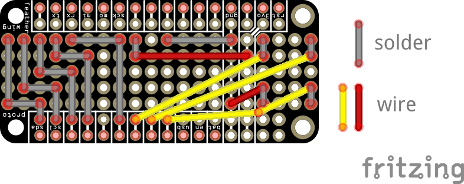

# Bike Blinker
This project is aimed at creating a bicycle turn signal system consisting of two Arduino-compatible boards, communicating via radio. The 'control' board attaches to the bicycle handlebar and is used to set and unset the turn signal, as well as to indicate the active signal. The 'signal' boards connect to the rear of the bicycle, and performs the signaling with an attached LED array. The two modules communicate using a 900mhz radio transciever.

# Components and materials
## Controller
- [Adafruit Feather M0 RFM69HCW Packet Radio](https://www.adafruit.com/product/3176)
- [Header Kit for Feather - 12-pin and 16-pin Female Header Set](https://www.adafruit.com/product/2830)
- [FeatherWing Proto - Prototyping Add-on For All Feather Boards](https://www.adafruit.com/product/2884)
- [Lithium Ion Polymer Battery - 3.7v 500mAh](https://www.adafruit.com/product/1578)
- [5-way Navigation Switch](https://www.adafruit.com/product/504)
- [Navigation Switch Joystick Cap](https://www.adafruit.com/product/4697)
- [Screen to indicate signal state to cyclist](https://www.adafruit.com/product/1431)
    - This particular screen might be overkill. I had one lying around and chose to use it, but a bright, grayscale OLED display could be cheaper and just as effective.

## Blinker
- [Adafruit Feather M0 RFM69HCW Packet Radio](https://www.adafruit.com/product/3176)
- [Adafruit 15x7 CharliePlex LED Matrix Display FeatherWing Yellow](https://www.adafruit.com/product/3135)
- [Lithium Ion Polymer Battery - 3.7v 500mAh](https://www.adafruit.com/product/1578)

## Equipment
- Soldering iron
- Rosin-core solder
- Data-transmitting micro-usb cable (as opposed to charging-only)
- Assorted wires

-----

# Assembly
Assembly should be very straightforward for this project, since the radio module is included on the Feather board. The controller will require some soldering skill, but there isn't much to do.

If you're not confident in your soldering abilities, get a few extra FeatherWing protos and 5-way switches. They're both highly affordable parts.

## Feathers with built-in radio
To start assembly, you'll need to solder the female headers to the top of your Feather boards, and attach an antenna for your radio.

To help properly align the headers, try this: first, push the MALE headers that came with your FeatherWing into a breadboard, properly spaced for the Featherwing. Then attach the female headers on top of them.

Finally, place the board, upside-down, on the female headers, properly aligned to the board's pins. Now the board and headers are aligned, perpendicular, and ready to be soldered.

## Controller
The control board consists of the FeatherWing proto, customized to support the OLED display and the 5-way switch.

> If you want to avoid all the controller assembly, pick up the [Adafruit Mini Color TFT with Joystick FeatherWing](https://www.adafruit.com/product/3321). It shouldn't be too hard to adapt the Arduino sketches in this tutorial to this particular FeatherWing, and you could skip the wiring and assembly of the custom wing. Only downside is you skip the wiring and assembly of the custom wing!

 The gray connections represent solder jumpers, and the colored connections are wires. All wiring should go on the BACK of the board to allow room for the user-interfacing components. 
 
 > One tip from my experience: don't solder the top row of through-holes just yet– it complicates things quite a bit when it's time to attach the components. Just solder everything else and come back to these when it's time to flip the board over and attach components.

The interface components can then be soldered to the front of the board.

## Blinker
Thanks to Adafruit's awesomeness, there is minimal required assembly for the blinker. All you need to do is solder the female stacking headers to the Feather, and the male headers (pointing downward) to the LED array FeatherWing, smush 'em together and they're working.

# Programming
## Control board
## Signal board